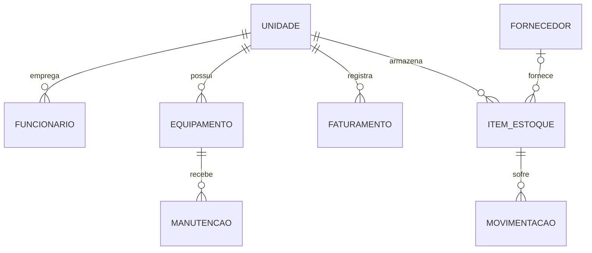

# 🍞 Sistema de Gerenciamento Comercial e Produtivo

Sistema web para o gerenciamento comercial e produtivo de uma empresa de **pães artesanais**, desenvolvido em **Django** como projeto da disciplina de Programação Web (UFOP).

> A ideia nasceu na disciplina de Engenharia de Software II. Nesta versão o sistema está sendo **reconstruído do zero**, com escopo revisado e usando as tecnologias vistas em Programação Web.

---

## Sumário

1. [Ideia geral do sistema](#1-ideia-geral-do-sistema)
2. [Tecnologias](#2-tecnologias)
3. [Páginas e rotas](#3-páginas-e-rotas)
4. [Arquitetura do projeto](#4-arquitetura-do-projeto)
5. [Modelo de dados](#5-modelo-de-dados)
6. [Organização do GitHub](#6-organização-do-github)
7. [Cronograma](#7-cronograma)
8. [Como rodar o projeto](#8-como-rodar-o-projeto)
9. [Status do desenvolvimento](#9-status-do-desenvolvimento)
10. [Equipe](#10-equipe)

---

## 1. Ideia geral do sistema

Uma empresa de pães artesanais com mais de uma unidade precisa acompanhar, no dia a dia, quem são seus clientes e fornecedores, quanto tem de insumo e de produto em estoque, quem trabalha em cada unidade, quanto cada unidade faturou e em que estado estão seus equipamentos (fornos, masseiras, câmaras frias). Hoje essas informações costumam ficar espalhadas em planilhas e cadernos.

O sistema centraliza tudo isso em uma única interface web, de uso do **gerente** da empresa.

### O que o gerente consegue fazer

| Módulo | Descrição |
| --- | --- |
| **Autenticação** | Login e logout. Nenhuma página interna é acessível sem estar autenticado. |
| **Dashboard** | Visão geral com indicadores: itens com estoque baixo, faturamento do mês, manutenções pendentes e atalhos para os módulos. |
| **Clientes** | Cadastro, consulta, edição e remoção de clientes. |
| **Fornecedores** | Cadastro de fornecedores com CNPJ, contato e observações. |
| **Unidades** | Cadastro das unidades da empresa, usadas como referência por funcionários, estoque e faturamento. |
| **Funcionários** | Cadastro de funcionários vinculados a uma unidade, com cargo, contato e situação. |
| **Estoque** | Cadastro de produtos e insumos, registro de entradas e saídas e histórico de movimentações. Saídas que deixariam o estoque negativo são bloqueadas. |
| **Faturamento** | Lançamentos de faturamento por unidade, com data, valor e descrição. |
| **Manutenção** | Cadastro de equipamentos e registro das manutenções, com data, custo e status. |

### O que melhora em relação à versão anterior

- **Busca e filtros** nas listagens (por nome, unidade, período, status).
- **Paginação** das listagens.
- **Validações** de formulário (CNPJ, campos obrigatórios, valores negativos, regras de estoque).
- **Dashboard com indicadores reais**, em vez de apenas um menu de módulos.
- **Mensagens de feedback** após cada ação (cadastro realizado, erro de validação, item removido).
- **Autenticação nativa do Django**, com senhas armazenadas de forma segura, em vez de credenciais fixas em arquivo.
- **Testes automatizados** das regras principais.

---

## 2. Tecnologias

| Camada | Tecnologia | Papel no projeto |
| --- | --- | --- |
| Linguagem | **Python 3** | Linguagem do back-end. |
| Framework web | **Django** | Rotas, views, ORM, formulários, autenticação e painel administrativo. |
| Front-end | **Django Templates** + HTML | Páginas renderizadas no servidor, com herança de templates (`base.html`). |
| Estilo | **Tailwind CSS** | Estilização com classes utilitárias, como visto na disciplina. |
| Interatividade | **JavaScript** | Pequenos comportamentos no navegador (confirmação de exclusão, menu responsivo). |
| Banco de dados | **SQLite** | Banco padrão do Django, sem necessidade de instalação. Como o acesso é feito pelo ORM, pode ser trocado por PostgreSQL ou MySQL sem alterar o código. |
| Versionamento | **Git** e **GitHub** | Código, issues, pull requests e quadro Kanban (GitHub Projects). |

### Recursos do Django que serão usados

- **Models e ORM** para definir as tabelas e consultar o banco sem escrever SQL.
- **Migrations** para versionar a estrutura do banco.
- **Class-Based Views** genéricas (`ListView`, `CreateView`, `UpdateView`, `DeleteView`) para os CRUDs.
- **ModelForms** para gerar e validar formulários.
- **`django.contrib.auth`** para login, logout e proteção das páginas (`LoginRequiredMixin`).
- **`django.contrib.messages`** para as mensagens de feedback.
- **Django Admin** como ferramenta de apoio durante o desenvolvimento.
- **Fixtures** para popular o banco com dados fictícios de demonstração.

---

## 3. Páginas e rotas

Todas as rotas, exceto `/login/`, exigem usuário autenticado.

### Acesso e visão geral

| Rota | Página | Descrição |
| --- | --- | --- |
| `/login/` | Login | Formulário de acesso do gerente. |
| `/logout/` | — | Encerra a sessão e redireciona para o login. |
| `/` | Dashboard | Indicadores e atalhos para os módulos. |
| `/admin/` | Django Admin | Painel administrativo nativo, para apoio ao desenvolvimento. |

### Cadastros (padrão CRUD)

Clientes, fornecedores, unidades e funcionários seguem o mesmo padrão de quatro páginas. O exemplo abaixo usa `clientes`; para os demais, basta trocar o prefixo por `fornecedores`, `unidades` ou `funcionarios`.

| Rota | Página | Descrição |
| --- | --- | --- |
| `/clientes/` | Listagem | Tabela com busca, filtros e paginação. |
| `/clientes/novo/` | Cadastro | Formulário de criação. |
| `/clientes/<id>/editar/` | Edição | Formulário preenchido com os dados atuais. |
| `/clientes/<id>/excluir/` | Confirmação de exclusão | Pede confirmação antes de remover. |

### Estoque

| Rota | Página | Descrição |
| --- | --- | --- |
| `/estoque/` | Itens em estoque | Produtos e insumos com quantidade atual e alerta de estoque baixo. |
| `/estoque/novo/` | Cadastro de item | Novo produto ou insumo. |
| `/estoque/<id>/editar/` | Edição de item | Altera os dados do item. |
| `/estoque/<id>/excluir/` | Confirmação de exclusão | Remove o item. |
| `/estoque/<id>/movimentar/` | Nova movimentação | Registra entrada ou saída do item. |
| `/estoque/movimentacoes/` | Histórico | Todas as movimentações, com filtro por item, tipo e período. |

### Faturamento

| Rota | Página | Descrição |
| --- | --- | --- |
| `/faturamento/` | Lançamentos | Listagem com filtro por unidade e período, e total do período. |
| `/faturamento/novo/` | Novo lançamento | Registra um faturamento de uma unidade. |
| `/faturamento/<id>/editar/` | Edição | Altera um lançamento. |
| `/faturamento/<id>/excluir/` | Confirmação de exclusão | Remove um lançamento. |

### Manutenção

| Rota | Página | Descrição |
| --- | --- | --- |
| `/manutencao/` | Manutenções | Listagem com filtro por equipamento e status. |
| `/manutencao/nova/` | Nova manutenção | Registra uma manutenção para um equipamento. |
| `/manutencao/<id>/editar/` | Edição | Altera dados ou status da manutenção. |
| `/manutencao/<id>/excluir/` | Confirmação de exclusão | Remove a manutenção. |
| `/manutencao/equipamentos/` | Equipamentos | Listagem dos equipamentos cadastrados. |
| `/manutencao/equipamentos/novo/` | Cadastro de equipamento | Novo equipamento. |
| `/manutencao/equipamentos/<id>/editar/` | Edição de equipamento | Altera os dados do equipamento. |
| `/manutencao/equipamentos/<id>/excluir/` | Confirmação de exclusão | Remove o equipamento. |

---

## 4. Arquitetura do projeto

O sistema segue o padrão **MTV** do Django (Model, Template, View) e é dividido em **apps**, um por módulo. Cada app tem seus próprios models, views, formulários, rotas e templates, o que permite que os integrantes trabalhem em paralelo sem conflito.

```text
.
├── manage.py
├── requirements.txt
├── README.md
├── config/                  # configurações do projeto
│   ├── settings.py
│   └── urls.py              # rotas principais (inclui as rotas de cada app)
├── core/                    # dashboard, login e template base
├── clientes/
├── fornecedores/
├── unidades/
├── funcionarios/
├── estoque/
├── faturamento/
├── manutencao/
├── templates/
│   └── base.html            # layout comum: menu, mensagens, rodapé
└── static/                  # CSS, JavaScript e imagens
```

Estrutura interna de cada app:

```text
clientes/
├── models.py                # tabelas do módulo
├── forms.py                 # formulários e validações
├── views.py                 # lógica das páginas
├── urls.py                  # rotas do módulo
├── tests.py                 # testes automatizados
├── admin.py                 # registro no Django Admin
├── migrations/
└── templates/clientes/      # páginas do módulo
```

---

## 5. Modelo de dados

Versão inicial das entidades. Os campos podem ser ajustados ao longo do desenvolvimento.

| Entidade | Principais campos | Relacionamentos |
| --- | --- | --- |
| **Cliente** | nome, CPF/CNPJ, telefone, e-mail, endereço | — |
| **Fornecedor** | razão social, CNPJ, contato, telefone, e-mail, observações | — |
| **Unidade** | nome, endereço, telefone | — |
| **Funcionário** | nome, cargo, telefone, situação (ativo/inativo) | pertence a uma **Unidade** |
| **ItemEstoque** | nome, tipo (produto/insumo), unidade de medida, quantidade, quantidade mínima | pertence a uma **Unidade**; pode ter um **Fornecedor** |
| **Movimentação** | tipo (entrada/saída), quantidade, data, observação | pertence a um **ItemEstoque** |
| **Faturamento** | data, valor, descrição | pertence a uma **Unidade** |
| **Equipamento** | nome, descrição | pertence a uma **Unidade** |
| **Manutenção** | data, custo, status (pendente/em andamento/concluída), descrição | pertence a um **Equipamento** |



---

## 6. Organização do GitHub

### Quadro Kanban

As tarefas são acompanhadas em um quadro no **GitHub Projects**:

🔗 **Quadro Kanban:** _adicionar o link do quadro aqui_

| Coluna | Significado |
| --- | --- |
| **Backlog** | Tarefas levantadas, ainda sem previsão. |
| **A fazer** | Tarefas da semana atual. |
| **Em andamento** | Tarefas com alguém trabalhando. |
| **Em revisão** | Pull request aberto, aguardando revisão. |
| **Concluído** | Pull request aprovado e integrado à `main`. |

### Fluxo de trabalho

1. Cada tarefa é uma **issue**, com responsável e etiqueta do módulo.
2. Para cada issue, cria-se uma **branch** a partir da `main`.
3. Ao terminar, abre-se um **pull request** referenciando a issue (`Closes #12`).
4. Outro integrante **revisa** antes do merge.
5. A `main` deve estar sempre funcionando.

### Padrões

| Item | Padrão | Exemplo |
| --- | --- | --- |
| Branches | `tipo/descricao-curta` | `feat/crud-clientes`, `fix/saida-estoque-negativa` |
| Commits | `tipo: descrição` | `feat: adiciona listagem de fornecedores` |
| Tipos | `feat`, `fix`, `docs`, `style`, `refactor`, `test` | — |
| Etiquetas | uma por módulo, mais `bug` e `documentação` | `estoque`, `faturamento` |

---

## 7. Cronograma

Sete semanas, com entregas semanais.

| Semana | Foco | Entregas |
| --- | --- | --- |
| **1** | Planejamento e base | README, rotas definidas, quadro Kanban, projeto Django criado, template base. |
| **2** | Autenticação e primeiros cadastros | Login e logout, proteção das páginas, CRUD de unidades e de clientes. |
| **3** | Cadastros restantes | CRUD de fornecedores e de funcionários, busca e paginação nas listagens. |
| **4** | Estoque | Cadastro de itens, entradas e saídas, bloqueio de estoque negativo, histórico. |
| **5** | Faturamento e manutenção | Lançamentos por unidade, equipamentos e manutenções, filtros por período e status. |
| **6** | Dashboard e qualidade | Indicadores no dashboard, validações, testes automatizados, dados fictícios. |
| **7** | Finalização | Ajustes visuais, correções, revisão da documentação e preparação da apresentação final. |

---

## 8. Como rodar o projeto

Pré-requisitos: **Python 3.10+** e **Git**.

```bash
# 1. Clonar o repositório
git clone <url-do-repositorio>
cd <pasta-do-repositorio>

# 2. Criar e ativar o ambiente virtual
python -m venv venv
source venv/bin/activate        # Linux, macOS e WSL
venv\Scripts\activate           # Windows

# 3. Instalar as dependências
pip install -r requirements.txt

# 4. Criar as tabelas do banco
python manage.py migrate

# 5. Criar o usuário do gerente
python manage.py createsuperuser

# 6. Iniciar o servidor
python manage.py runserver
```

Acesse `http://127.0.0.1:8000/`.

### Comandos úteis

| Comando | O que faz |
| --- | --- |
| `python manage.py makemigrations` | Gera migrations após alterar um model. |
| `python manage.py migrate` | Aplica as migrations no banco. |
| `python manage.py test` | Executa os testes automatizados. |
| `python manage.py loaddata <arquivo>` | Carrega dados fictícios a partir de uma fixture. |

---

## 9. Status do desenvolvimento

- [ ] Repositório criado e organizado
- [ ] Quadro Kanban configurado
- [ ] Projeto Django criado (`config`)
- [ ] App `core` com template base
- [ ] Login e logout
- [ ] Dashboard
- [ ] Unidades
- [ ] Clientes
- [ ] Fornecedores
- [ ] Funcionários
- [ ] Estoque
- [ ] Faturamento
- [ ] Manutenção
- [ ] Testes automatizados
- [ ] Dados fictícios de demonstração

---

## 10. Equipe

- Brenda Gabrielle
- Diogo Campos
- Matheus Rodrigues
- Pedro Henrique Gomes
- Thiago Henrique

---

Projeto acadêmico desenvolvido para a disciplina de Programação Web — Universidade Federal de Ouro Preto (UFOP).
